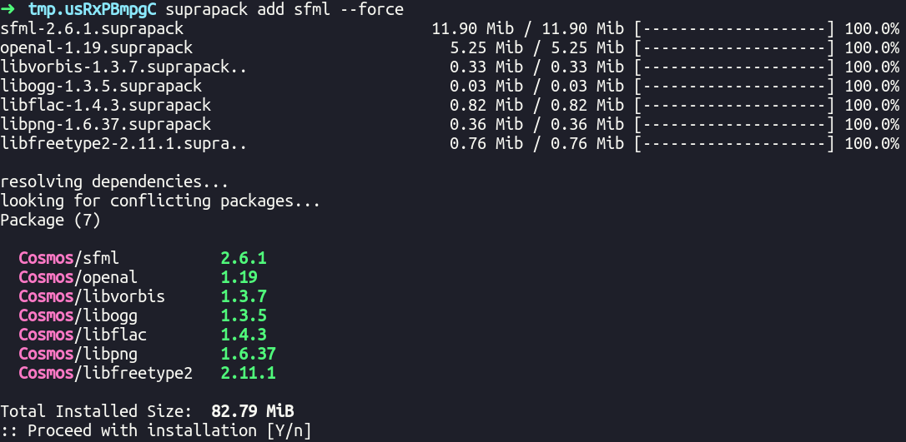

# Suprapack the package manager without root


## Installation
#### Dependency

- valac Or C compiler (gcc or clang ...)
- Glib-2.0  (2.10) >    
- glib-networking

#### Compiling and install

```bash
git clone https://gitlab.com/nda-cunh/suprapack
cd suprapack
make install
```

# For simple user :

| Commands | definition |
| ------ | ------ |
| add / install	| install a package from the repository|
| remove / uninstall	|Remove an installed package|
| update	| Update all installed packages or a specific package|
| search	| Search for a package in the repository using patterns |
| list	| List all installed packages |
| list_files	| List all files installed by a specific package |
| info	| Print information about a specific package |
| help	| Display help information for SupraPack commands |
| config | Update a configuration value in your user.conf file |
| download | for dev you can get the suprapack file of the package without install |

## Installing a package

Install a package from the repository.
```
suprapack install [package name]
```

Install a package from a SupraPack file.
```
suprapack install [file.suprapack]
```
## Removing a package

Remove an installed package.
```
suprapack remove [package name]
```

## Updating packages

Update all installed packages.
```
suprapack update
```

Update a specific package.
```
suprapack update [package name]
```

## Searching for a package
Search for a package in the repository. You can use patterns for searching.

Example: suprapack search '^supra.*'
```
suprapack search <pkg>
```

## Listing files installed by a package
List all files installed by a specific package.
```
suprapack list_files <pkg>
```

## Listing installed packages

List all installed packages.
```
suprapack list <pkg>
```

## Displaying package information
Print information about a specific package
```
suprapack info [package name]
```

<br>
<br>

----------------------------------------
# Exemple with simple installation of SFML package



# Config

## Updating config
Update a configuration value in your user.conf file.
```
suprapack config [config name] [config value]
```

## RepositoryList '~/.config/suprapack/repo.list'
an example of RepoListL
```
Cosmos https://gitlab.com/supraproject/suprastore_repository/-/raw/master/cosmos/
Supravim https://gitlab.com/supraproject/suprastore_repository/-/raw/master/supravim/
Supravim https://gitlab.com/supraproject/suprastore_repository/-/raw/plugin-supravim/
```
you can add a repository with NAME and the url/directory of the repo


## `~/.config/suprapack/user.conf`

is_cached:true          # if true suprapack keep suprapack at `~/.config/suprapack/pkg`
show_script:false       # show script pre and post install before installing
prefix:~/.local         # change your prefix installation like '/' or other

## Arguments

--yes           # say yes everytime ! dont tell this ([Y/n])
--force         # force reinstall ([Y/n])
--prefix        # change the prefix temporary ([Y/n])


# Developper

you can build a package with fake `usr` folder or with a script `PKGBUILD`

## Without Script

To build a package you need create a fake root directory like
```
usr/
usr/bin/your_program
usr/share/applications/blabla.desktop
usr/lib/your_lib
usr/...
```

and make ``suprapack build usr``

you will enter the package creation mode
if you need a script pre and/or post install you can add at usr/post_install or usr/pre_install

in 2.5.2 you can add uninstall script in usr/uninstall 


## With Script

Suprapack support PKGBUILD-script since 2.2 like ArchLinux Pacman

exemple of pkgbuild:
```bash
pkgname=nameofpkg
pkgver=128.521.20
pkgdesc="The supra description"
pkgauthor=suprAuthor


source=('https://supra-project/file.zip')

makedepends=('vala')

package() {
    unzip file.zip
    mv file $pkgdir/usr/bin/
}
	
```
here all variable:
- srcdir
- pkdir
- prefix

here all attributs suprapack build can use:
- pkgname
- pkgver
- pkgdesc
- pkgauthor
- source 
- depends 
- conflicts
- makedepends

here function:
<details><summary>prepare</summary>call before package</details>
<details><summary>package</summary>move $srcdir/file to $pkgdir</details>


you can add as many functions as you like
example:
```bash
pkgver(){
    echo -n "5.2"
}

# all output is now the content of pkgver
package() {
    echo $pkgver
    #output is 5.2
}
```
this principle applies to all your functions


### source

with source() you can download some source or copy file into srcdir
```bash
source=('https://domain.net/file'
        'https://otherdomain.net/file2')
```

source support:
- http download
- simple file
- git url

use 'git+url' if it's git url
```bash
source=('git+https://gitlab.com/nda-cunh/suprapack')
```

my_file will be copied to $srcdir
```bash
source=('my_file')
```

you can force rename the source with '::'
```bash
source=('name::https://gitlab.com/nda-cunh/suprapack')
```

### other tips

you can make a variable with other variable:
```bash
pkgname=hello
pkgver=5.2
nameofsource=${pkgname}-${pkgver}

source='$nameofsource::https://download/file-${pkgver}.tar.gz'
```

# Repository

If you want create a repository you need fill a folder with all file.suprapack
```
./a.suprapack
./b.suprapack
./hello.suprapack
```

and use `suprapack prepare`
you can push your repository and add it in mirrorlist
